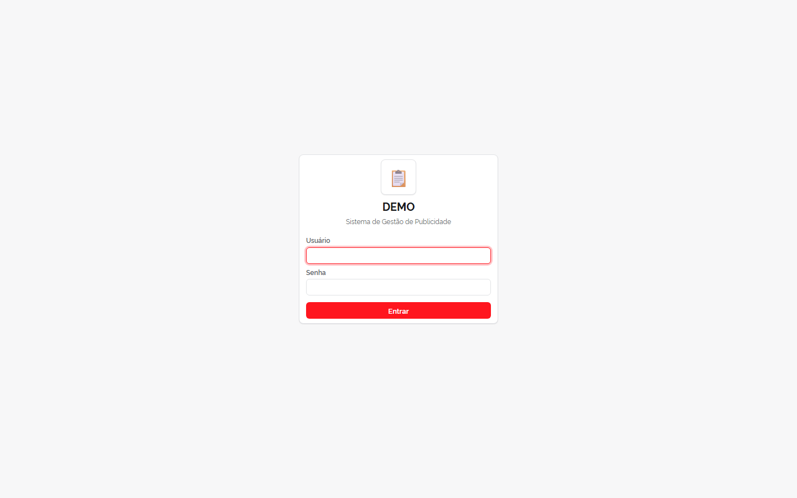
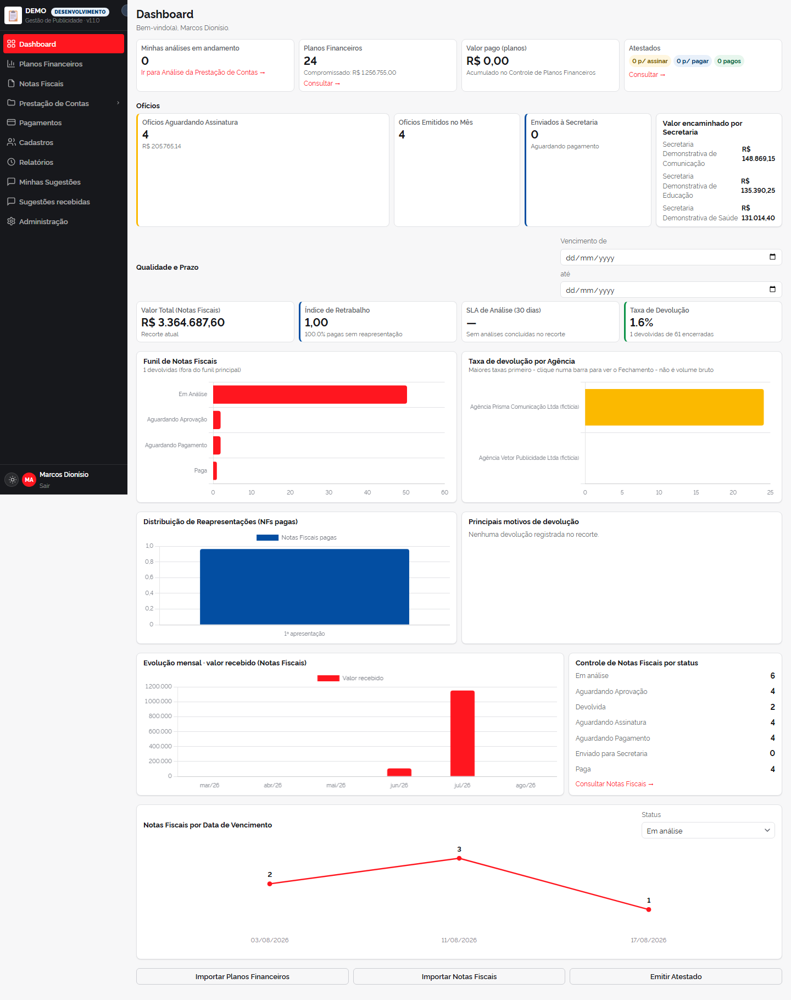
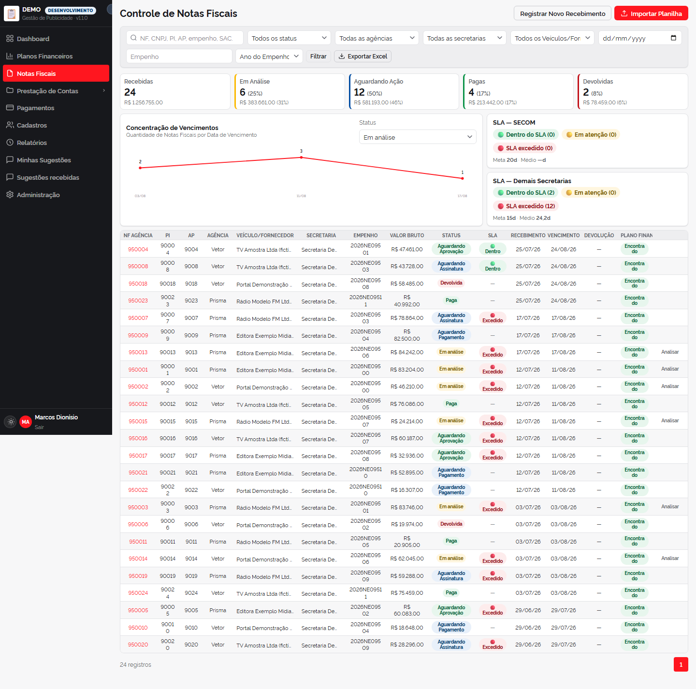
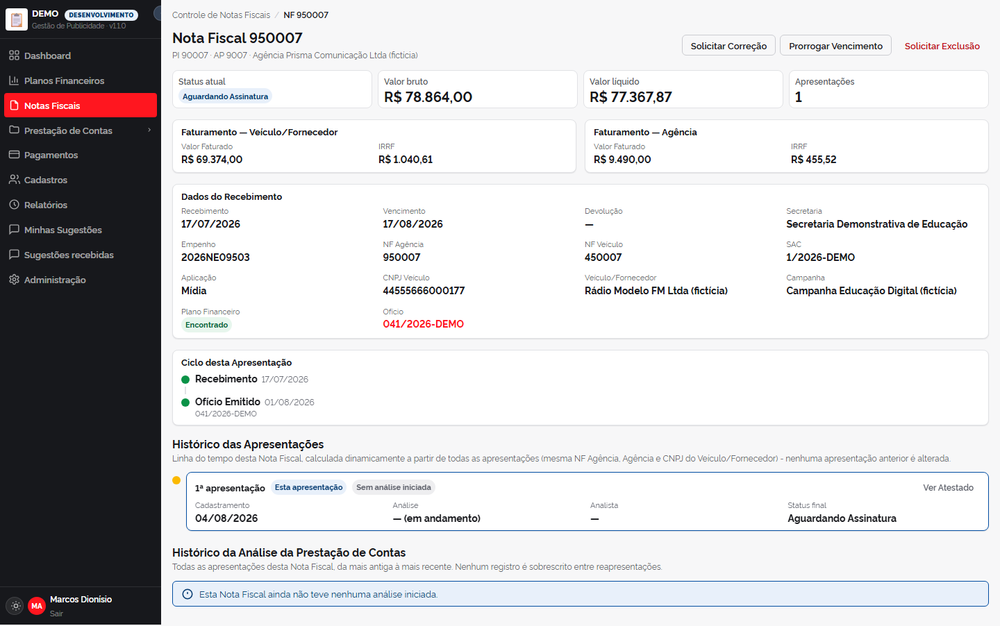
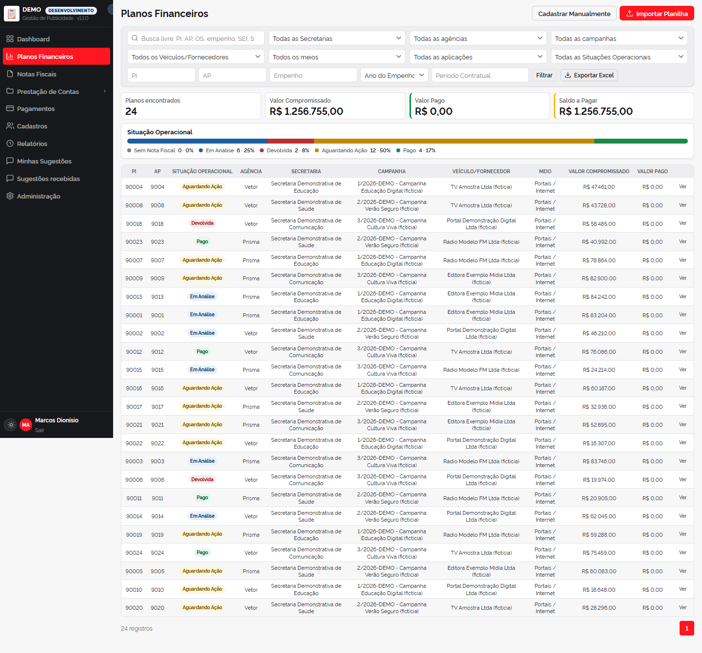
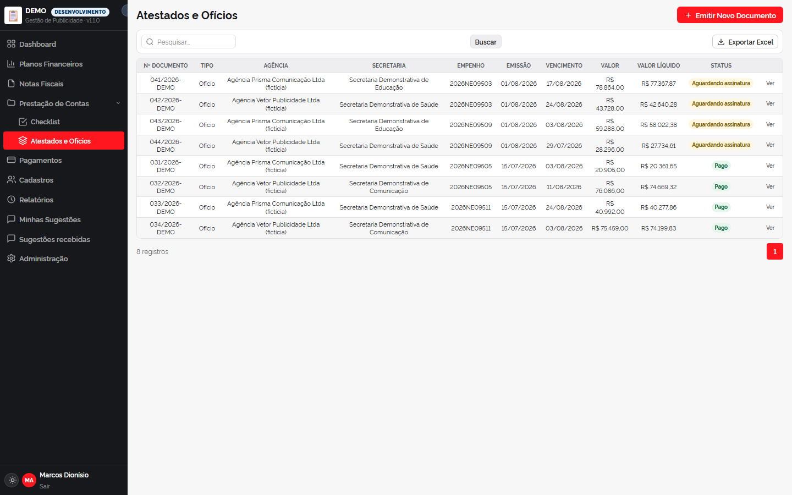

# Sistema de Gestão de Contratos de Publicidade — Case Study

*Um sistema desenvolvido para digitalizar o controle financeiro e de conformidade de um órgão público que antes dependia inteiramente de planilhas.*

> Este repositório documenta a arquitetura e as decisões de engenharia do projeto — não o código-fonte.

---

## Minha função neste projeto

Não sou desenvolvedor — meu papel aqui foi de dono de produto e arquiteto de solução. Eu identifiquei o problema, levantei cada regra de negócio a partir do processo real da equipe (o que pode ser corrigido sem aprovação, quando um vencimento muda de faixa de SLA, o que trava um pagamento), tomei as decisões de arquitetura e de produto, e conduzi a implementação do início ao fim.

A implementação foi feita com o **Claude Code** (Anthropic) como parceiro de engenharia: eu dirigindo cada decisão técnica e de negócio, revisando cada mudança, testando no navegador antes de qualquer coisa avançar. Não escondo isso — saber usar essa ferramenta bem, e saber fazer as perguntas certas de arquitetura, governança e regra de negócio, é exatamente a habilidade que este case study demonstra.

## O problema

Um departamento de comunicação de um órgão público estadual controlava toda a execução de seus contratos de publicidade — planos financeiros, notas fiscais, checklists de conformidade, atestados de recebimento, ofícios e pagamentos — em planilhas Excel soltas, sem histórico auditável, sem regra de negócio automatizada e sem visibilidade consolidada do que estava pendente.

O pedido: substituir isso por um sistema web único, sem perder nenhuma regra do processo real da equipe, e com trilha de auditoria completa (exigência natural de qualquer sistema financeiro público).

## O que o sistema faz

- **Plano Financeiro → Nota Fiscal → Checklist → Atestado/Ofício → Pagamento** — o ciclo de vida completo de uma contratação de publicidade, com vínculo automático entre os documentos por identificador de processo.
- **Checklist de conformidade** guiado, que bloqueia a aprovação quando a Nota Fiscal diverge do Plano Financeiro vinculado (agência, campanha, empenho, fornecedor, valores).
- **Cálculo automático de vencimento e SLA** — datas de vencimento avançam automaticamente para o próximo dia útil (considerando feriados cadastrados), e um painel de SLA mostra, por grupo, quantos dias faltam até cada lote de notas mudar de faixa (verde → amarelo → vermelho).
- **Emissão de documentos oficiais em PDF** (Atestados e Ofícios), com numeração sequencial automática por exercício e texto institucional gerado a partir dos dados do processo.
- **Importação/exportação de planilhas Excel** com validação linha a linha contra as mesmas regras de negócio da entrada manual — nunca um caminho "de exceção" mais permissivo que o outro.
- **Dashboards operacional e executivo**, com filtros cruzados entre indicadores e gráficos (clicar num indicador filtra o gráfico e a tabela ao mesmo tempo).

## Decisões de engenharia que valem destaque

**Auditoria e governança não foram "adicionadas depois"** — todo registro financeiro (Plano, Nota Fiscal, Atestado) herda um mixin comum que grava histórico completo de alterações, marca exclusão como lógica (nunca física) e distingue correção simples de substituição de registro, conforme o campo alterado for sensível ou não.

**Nenhuma edição sensível é aplicada direto no banco.** Qualquer alteração num campo crítico (valor, CNPJ, vencimento) vira uma *Solicitação de Alteração* — um fluxo de 4 estados (Solicitada → Aprovada/Rejeitada → Aplicada) que exige um segundo usuário (Coordenador) para aprovar, com justificativa obrigatória e registro de quem pediu e quem aprovou.

**Regras de negócio como funções puras, não como validação espalhada** — cálculo de vencimento, faixa de SLA, divergência entre Nota Fiscal e Plano Financeiro, tudo vive em módulos de regra isolados e testáveis, reaproveitados tanto pela tela quanto pela importação de planilha.

**Design system próprio, sem framework CSS de terceiros** — construído em cima de Design Tokens (CSS custom properties), com tema claro/escuro, para manter a interface leve e consistente sem depender de Bootstrap/Tailwind.

**Um único artefato Docker para os três ambientes** — a mesma imagem roda em desenvolvimento, homologação e produção; o que muda é só variável de ambiente e comando (`runserver` vs. `gunicorn`), nunca a imagem.

## Arquitetura

```
                              Usuário
                                │
                          Navegador (HTTPS)
                                │
                                ▼
                        ┌───────────────┐
                        │     Nginx     │  :80 → redirect / :443 (TLS)
                        └───────┬───────┘
                                │ proxy_pass
                                ▼
                    ┌────────────────────────┐
                    │   Django (Gunicorn)     │  :8000 (interno)
                    └──────┬───────────┬──────┘
                            │           │
                            ▼           ▼
                  ┌─────────────┐  ┌─────────┐
                  │ PostgreSQL  │  │  Redis  │
                  │  (dados)    │  │ (cache) │
                  └─────────────┘  └─────────┘

     Certbot renova o certificado TLS automaticamente, em background.
     Tudo roda em containers Docker na mesma rede interna, orquestrado
     por Docker Compose (overlay próprio por ambiente: dev/homolog/prod).
```

## Stack técnica

`Python` · `Django` · `PostgreSQL` · `Redis` · `Gunicorn` · `Nginx` · `Docker` / `Docker Compose` · `Let's Encrypt` · CSS puro (design system próprio, sem framework)

## Telas do sistema

*Dados fictícios — nenhuma informação do processo real aparece nas imagens abaixo.*













## Sobre os dados

Projeto desenvolvido de forma independente, fora do escopo formal de qualquer contrato, como iniciativa pessoal de estudo e aplicação prática de arquitetura de software. Dados, nomes de entidades e informações específicas do processo real não são divulgados aqui — as imagens acima usam uma base fictícia gerada só para esta demonstração.
